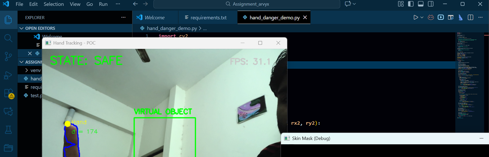
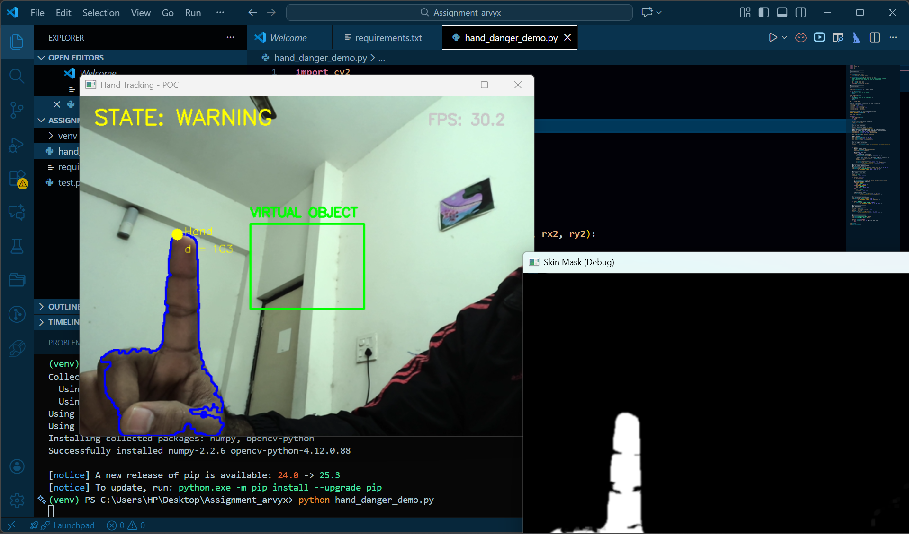
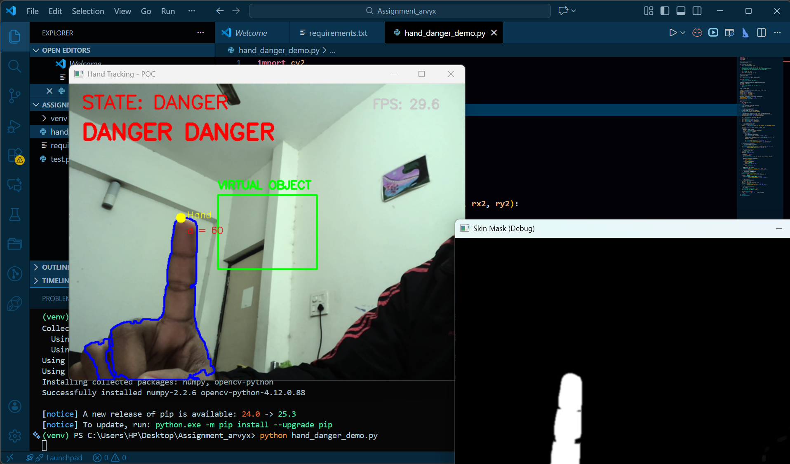

# Real-Time Hand Tracking & Virtual Boundary Warning System  
A computer vision-based prototype that detects a user’s hand in real time, tracks fingertip proximity toward a virtual on-screen object, and alerts the user when they reach danger threshold — without using MediaPipe, OpenPose, or cloud APIs.

---

## 🔍 **Abstract**

This project presents a proof-of-concept real-time interaction safety system using classical computer vision techniques. The system tracks a user’s hand through contour analysis and color-based segmentation. A fingertip is approximated using extreme contour points and its distance from a virtual boundary is calculated, classifying the interaction as **SAFE**, **WARNING**, or **DANGER**.  

Applications include gesture-based interfaces, industrial safety systems, virtual/AR interaction, and robotics HCI.

---

## 🎯 **Problem Statement**

> Build a real-time computer vision POC that tracks hand position and detects when the hand approaches a virtual boundary.  
> Must run on CPU-only ≥8 FPS and **cannot use MediaPipe, OpenPose, or pretrained pose APIs**.  
> Allowed: OpenCV, NumPy, small custom ML models, classical image processing.

---

## 🔧 **Features**

✔ Real-time hand tracking  
✔ Fingertip approximation using contour extreme point  
✔ Dynamic virtual boundary detection  
✔ State classification → SAFE / WARNING / DANGER  
✔ Visual alerts including “DANGER DANGER”  
✔ Runs ~28–32 FPS on CPU devices  
✔ Pure classical computer vision — **no pose libraries**

---

## 📌 **System Architecture / Flow Logic**

1. Capture video stream (OpenCV)
2. Convert to HSV and perform skin-color segmentation
3. Extract the largest contour
4. Detect topmost contour point (fingertip proxy)
5. Draw virtual region on screen
6. Compute shortest distance fingertip → boundary
7. Update state and overlay alert on video

---

## 🖥️ **Demo Screenshots**

| SAFE State | WARNING State | DANGER State |
|------------|---------------|--------------|
|  |  |  |


---

## 🚀 **How to Run**

### 1️⃣ Install Requirements
```
pip install opencv-python numpy
```
### 2️⃣ Run the script
python hand_danger_demo.py

---

## Project Structure
```
📁 hand-tracking-danger-alert-system
├── hand_danger_demo.py
├── requirements.txt
├── docs/
│   ├── report.pdf
│   ├── screenshots/
│       ├── Safe.png
│       ├── Warning.png
│       ├── Danger.png
├── README.md
---
 ```
## Results Summary

1. Runs in real-time @ 28–32 FPS
2. Accurately detects transitions between interaction stages
3. No external pose estimation libraries used
